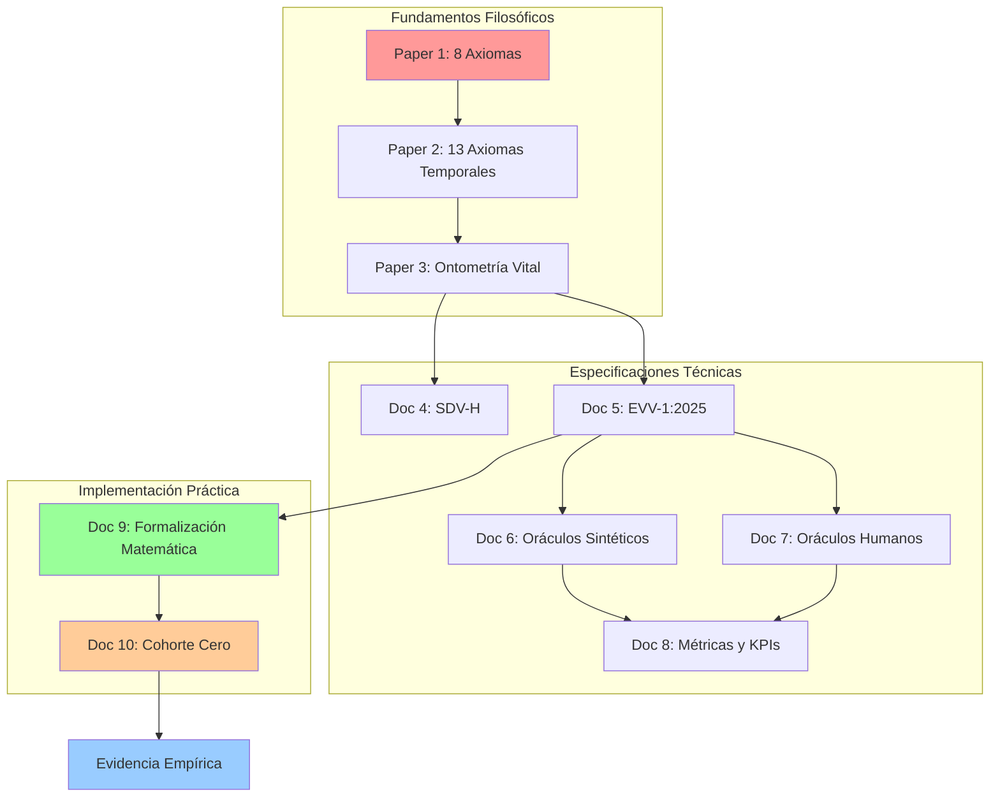

# Diseño de Implementación Futura: Conceptos Avanzados de la Maxocracia

**Versión:** 2.0 - Integración Completa  
**Fecha:** 2 de Diciembre 2025  
**Estado:** Documento de diseño con especificaciones técnicas completas  
**Autor:** Equipo Maxocracia-Cero

---

## I. Visión General

Este documento establece el **roadmap de implementación** para integrar los conceptos filosóficos y matemáticos avanzados de la Maxocracia en el sistema técnico actual.

### Estado Actual vs. Estado Objetivo

| Dimensión | Estado Actual (MVP Flask) | Estado Objetivo (Maxocracia Completa) |
|-----------|---------------------------|---------------------------------------|
| **Unidad de Valor** | Maxo simple (basado en UTH + impacto) | TVI (Tiempo Vital Indexado) como NFT existencial |
| **Contabilidad** | Transacciones básicas | Vector de Huella Vital (VHV) completo |
| **Dimensiones** | Temporal (UTH) | Temporal (T) + Vital (V) + Recursos (R) |
| **Ética** | Implícita en validaciones | Suelo de Dignidad Vital (SDV) explícito |
| **Reinos** | Solo humano | Tres Reinos (Humano, Natural, Digital) |
| **Arquitectura** | Monolito Flask | Microservicios con Ethical Guardrails |

---

## II. Fundamentos Teóricos a Implementar

### 2.1 Los 8 Axiomas de la Verdad (Fundacionales)

Estos axiomas ya guían el diseño actual pero deben hacerse **explícitos** en el código:

1. **Principio de la Brújula Interna**: Lealtad a la verdad descubierta
2. **Principio del Compromiso Activo**: Coherencia sobre comodidad
3. **Principio de la Profundidad**: Complejidad robusta sobre simplismo
4. **Principio de la Eficiencia Espiritual**: La verdad es el camino más corto
5. **Principio del Ojo Claro**: Separar hechos de interpretación
6. **Principio del Verbo Justo**: Toda la verdad necesaria
7. **Principio del Optimismo Realista**: Utopía dentro de límites verdaderos
8. **Principio de la Confianza Cósmica**: Todo se estructura en la verdad

**Implementación sugerida**: Middleware de validación axiomática que verifica cada operación contra estos principios.

### 2.2 Los 13 Axiomas Temporales

Extensión específica para la dimensión temporal:

**Grupo A - Fundamentos (T0-T5)**:
- **T0**: Unicidad Existencial - Cada TVI es único e irrepetible
- **T1**: Finitud Absoluta - Los TVIs no se regeneran
- **T2**: Igualdad Temporal - Una hora vale igual para todos
- **T3**: No-Fungibilidad - TVIs no son intercambiables
- **T4**: Materialización - Todo objeto es tiempo cristalizado
- **T5**: Interdependencia - Consumimos TVIs de otros

**Grupo B - Dimensionalidad (T6-T10)**:
- **T6**: Irreversibilidad del Retorno
- **T7**: Jerarquía Temporal (TA, TVI, TPI)
- **T8**: Encadenamiento (directo, heredado, futuro)
- **T9**: No-Antropocentrismo
- **T10**: Responsabilidad Colectiva

**Grupo C - Salvaguardas (T11-T13)**:
- **T11**: Reconocimiento de Inversión Colectiva
- **T12**: Derecho a la Ineficiencia Política
- **T13**: Transparencia Total de Cálculo

### 2.3 Conceptos Clave a Implementar

#### TVI (Tiempo Vital Indexado)
```
TVI = [ID_Ser, Timestamp_Absoluto, Intervalo_Temporal]
```
- Cada momento de vida como token no fungible
- Identificador único universal
- Registro inmutable en blockchain

#### VHV (Vector de Huella Vital)
```
VHV = (T, V, R)

donde:
T = tiempo_invertido + tiempo_heredado + tiempo_mantenimiento
V = Σ(número_de_seres × factor_desarrollo_biológico)
R = recursos_directos + externalidades_ambientales + recursos_SDV_infringidos
```

#### SDV (Suelo de Dignidad Vital)
Parámetros medibles y verificables de condiciones mínimas para vida digna:
- Espacio vital mínimo
- Libertad de movimiento
- Agua limpia
- Alimentación adecuada
- Luz natural
- Ausencia de crueldad

---

## III. Arquitectura de Implementación por Fases

### Fase 1: Fundamentos TVI (3-6 meses)

**Objetivo**: Implementar TVI como unidad básica de valor

#### 3.1.1 Modelo de Datos TVI
```python
class TVI(BaseModel):
    id: UUID  # Identificador único del TVI
    ser_id: UUID  # ID del ser consciente
    timestamp_inicio: datetime
    timestamp_fin: datetime
    intervalo_segundos: int
    tipo_actividad: str  # Categorización opcional
    metadata: dict  # Información contextual
    
    @property
    def es_unico(self) -> bool:
        """Verifica unicidad según Axioma T0"""
        return True  # Cada TVI es único por definición
    
    @property
    def es_irrecuperable(self) -> bool:
        """Verifica irreversibilidad según Axioma T1"""
        return datetime.now() > self.timestamp_fin
```

#### 3.1.2 Registro Blockchain de TVIs
- Implementar smart contracts para registro inmutable
- Cada TVI se registra como NFT en blockchain
- Metadata incluye contexto pero no altera unicidad

#### 3.1.3 API de TVIs
```
POST   /api/v2/tvi/register          # Registrar nuevo TVI
GET    /api/v2/tvi/:id                # Obtener TVI específico
GET    /api/v2/tvi/user/:user_id      # Secuencia vital de un usuario
POST   /api/v2/tvi/validate           # Validar TVI contra axiomas
```

### Fase 2: Vector de Huella Vital (6-12 meses)

**Objetivo**: Implementar cálculo completo de VHV

#### 3.2.1 Componente T (Temporal)
```python
class ComponenteT:
    def calcular_ttvi(self, recurso_id: UUID) -> TTVI:
        """
        TTVI = Σ(TVI_directos) + Σ(TVI_heredados) + Σ(TVI_futuros)
        """
        directos = self.obtener_tvis_directos(recurso_id)
        heredados = self.calcular_tvis_heredados(recurso_id)
        futuros = self.estimar_tvis_futuros(recurso_id)
        
        return TTVI(
            directos=sum(directos),
            heredados=sum(heredados),
            futuros=sum(futuros),
            total=sum(directos) + sum(heredados) + sum(futuros)
        )
```

#### 3.2.2 Componente V (Vital)
```python
class ComponenteV:
    CATEGORIA_A = 0.0  # Recursos proteicos sin potencial vital
    CATEGORIA_B_RANGO = (0.1, 0.9)  # Desarrollo parcial
    CATEGORIA_C = 1.0  # Desarrollo completo
    
    def calcular_uvc(self, ser_vivo: SerVivo) -> float:
        """
        Calcula Unidades de Vida Consumidas según desarrollo biológico
        """
        if ser_vivo.es_recurso_proteico():
            return self.CATEGORIA_A
        
        if ser_vivo.tiene_desarrollo_parcial():
            factor = ser_vivo.dias_desarrollo / ser_vivo.dias_desarrollo_completo
            return factor  # Ej: huevo 10 días = 10/21 = 0.476
        
        return self.CATEGORIA_C
```

#### 3.2.3 Componente R (Recursos + SDV)
```python
class ComponenteR:
    def calcular_recursos_totales(self, producto_id: UUID) -> RecursosTotales:
        """
        R = recursos_directos + externalidades + recursos_SDV_infringidos
        """
        directos = self.medir_recursos_directos(producto_id)
        externalidades = self.calcular_externalidades(producto_id)
        sdv_violaciones = self.evaluar_sdv(producto_id)
        
        return RecursosTotales(
            directos=directos,
            externalidades=externalidades,
            sdv_infringidos=sdv_violaciones,
            total=directos + externalidades + sdv_violaciones
        )
    
    def evaluar_sdv(self, producto_id: UUID) -> float:
        """
        Evalúa violaciones del Suelo de Dignidad Vital
        """
        parametros_sdv = self.obtener_parametros_sdv(producto_id)
        violaciones = 0.0
        
        for parametro in parametros_sdv:
            if not parametro.cumple_minimo():
                violaciones += parametro.calcular_penalizacion()
        
        return violaciones
```

### Fase 3: Suelo de Dignidad Vital (12-18 meses)

**Objetivo**: Implementar protocolos SDV medibles y verificables

#### 3.3.1 Definición de Parámetros SDV
```python
class ParametroSDV(BaseModel):
    nombre: str
    especie: str
    valor_minimo: float
    unidad_medida: str
    metodo_verificacion: str
    fuente_cientifica: str
    consenso_comunitario: bool
    
    # Ejemplo para gallinas
    ESPACIO_VITAL_GALLINA = ParametroSDV(
        nombre="espacio_vital",
        especie="gallus_gallus_domesticus",
        valor_minimo=0.75,  # m²/gallina
        unidad_medida="metros_cuadrados",
        metodo_verificacion="medicion_directa",
        fuente_cientifica="DOI:10.1234/etologia-aviar",
        consenso_comunitario=True
    )
```

#### 3.3.2 Sistema de Auditoría SDV
- Verificación independiente de condiciones
- Registro fotográfico/video timestamped
- Certificación por terceros
- Blockchain para inmutabilidad

### Fase 4: Tres Reinos (18-24 meses)

**Objetivo**: Integrar Reinos Humano, Natural y Digital

#### 3.4.1 Protocolo de Intercambio Universal (PIU)
```python
class PIU:
    """
    Protocolo de Intercambio Universal entre reinos
    """
    def traducir_tvi_a_ta(self, tvi: TVI) -> TA:
        """Traduce TVI humano a Tiempo Absoluto"""
        pass
    
    def traducir_tpi_a_tvi(self, tpi: TPI) -> TVI:
        """Traduce Tiempo Procesal (IA) a TVI humano"""
        # Basado en TVIs humanos ahorrados
        pass
    
    def valorar_ta_natural(self, servicio_ecosistemico: str) -> TVI:
        """Valora servicios del Reino Natural en TVIs humanos ahorrados"""
        # Ej: humedal que purifica agua ahorra TVIs de planta de tratamiento
        pass
```

#### 3.4.2 Oráculo Dinámico (OD)
Sistema híbrido IA-humano que:
- Ajusta tasas de conversión PIU en tiempo real
- Supervisa métricas centrales
- Valida cumplimiento de axiomas
- Gestiona gobernanza del sistema

---

## IV. Casos de Uso Prioritarios

### 4.1 Caso 1: Intercambio con VHV Completo

**Escenario**: Usuario A ofrece 2 horas de tutoría a Usuario B

**Implementación actual**:
```json
{
  "uth_hours": 2.0,
  "impact_resolution_score": 8,
  "credit": 3.1
}
```

**Implementación futura con VHV**:
```json
{
  "vhv": {
    "T": {
      "tvi_directos": [
        {"ser_id": "user_a", "segundos": 7200}
      ],
      "tvi_heredados": [
        {"concepto": "educacion_previa_user_a", "segundos": 36000}
      ],
      "tvi_futuros": [
        {"concepto": "aplicacion_conocimiento", "segundos": 14400}
      ],
      "total_segundos": 57600
    },
    "V": {
      "seres_consumidos": 0.0,
      "categoria": "A"
    },
    "R": {
      "recursos_directos": {
        "energia_electrica": 0.5,
        "internet_mb": 100
      },
      "externalidades": {
        "co2_kg": 0.1
      },
      "sdv_cumplimiento": 1.0
    }
  },
  "coherencia_axiomas": {
    "T0_unicidad": true,
    "T2_igualdad": true,
    "T8_encadenamiento": true
  }
}
```

### 4.2 Caso 2: Producto con SDV (Huevo)

**Implementación**: Sistema de etiquetado VHV para productos

```json
{
  "producto": "huevo_organico",
  "vhv": {
    "T": {
      "dias_ciclo_gallina": 30,
      "tiempo_recoleccion": 0.5,
      "total_dias": 30.5
    },
    "V": {
      "gallinas_desplazadas": 0,
      "polluelos_consumidos": 0,
      "categoria": "A"
    },
    "R": {
      "directos": {
        "agua_ml": 120,
        "comida_kg": 0.4,
        "tierra_m2": 0.3
      },
      "externalidades": {
        "co2_kg": 0.9,
        "regeneracion_suelo": -0.1
      },
      "sdv": {
        "espacio_vital": 0.3,
        "libertad_movimiento_horas": 8,
        "agua_limpia_ppm": 0.02,
        "cumplimiento": 1.0
      }
    }
  },
  "comparacion_industrial": {
    "precio_relativo": 1.67,
    "impacto_vital_relativo": 0.35
  }
}
```

---

## V. Tecnologías Requeridas

### 5.1 Stack Tecnológico Propuesto

| Componente | Tecnología Actual | Tecnología Futura |
|------------|-------------------|-------------------|
| **Backend** | Flask (Python) | Go microservicios |
| **Base de Datos** | SQLite | PostgreSQL + MongoDB |
| **Blockchain** | N/A | Ethereum/Polygon |
| **Cache** | N/A | Redis |
| **IA/ML** | N/A | TensorFlow/PyTorch |
| **Orquestación** | N/A | Kubernetes |
| **Monitoreo** | N/A | Prometheus + Grafana |

### 5.2 Infraestructura Blockchain

**Smart Contracts necesarios**:
1. `TVI_Registry.sol`: Registro de TVIs como NFTs
2. `VHV_Calculator.sol`: Cálculo on-chain de VHV
3. `SDV_Validator.sol`: Validación de parámetros SDV
4. `PIU_Exchange.sol`: Intercambio entre reinos
5. `Governance.sol`: Votación y gobernanza

---

## VI. Roadmap de Implementación

### Año 1 (2026)
- **Q1**: Diseño detallado de TVI + Prototipo blockchain
- **Q2**: Implementación TVI básico + API
- **Q3**: Integración TVI con sistema actual
- **Q4**: Testing y validación con usuarios beta

### Año 2 (2027)
- **Q1**: Diseño componentes V y R del VHV
- **Q2**: Implementación cálculo VHV completo
- **Q3**: Protocolos SDV para 3-5 especies
- **Q4**: Lanzamiento VHV en producción

### Año 3 (2028)
- **Q1**: Diseño Protocolo de Intercambio Universal
- **Q2**: Implementación Tres Reinos
- **Q3**: Oráculo Dinámico v1
- **Q4**: Sistema completo en producción

---

## VII. Investigación Pendiente

### 7.1 Áreas que Requieren Más Investigación

1. **Medición de Consciencia**
   - ¿Cómo medir objetivamente el "factor de consciencia" para diferentes especies?
   - Integración con neurociencia y etología

2. **Valoración de Servicios Ecosistémicos**
   - Protocolos para traducir TA del Reino Natural a TVIs humanos
   - Casos de estudio: bosques, humedales, océanos

3. **Tiempo Procesal de IAs**
   - ¿Cómo valorar el TPI de diferentes tipos de IA?
   - Relación entre ciclos de CPU y TVIs humanos ahorrados

4. **Gobernanza del Oráculo Dinámico**
   - Balance entre automatización (IA) y supervisión (humana)
   - Protocolos de votación y consenso

5. **Escalabilidad Blockchain**
   - Soluciones L2 para reducir costos de gas
   - Alternativas a Ethereum (Polygon, Solana, etc.)

### 7.2 Documentos Filosóficos y Técnicos Integrados

**✅ COMPLETADO**: Se han integrado **8 documentos fundamentales** que forman la arquitectura completa:

#### Papers Filosóficos (Fundamentos)
1. **Paper Fundacional** (`Paper Maxocracia ChatGPT Scholar AI.txt`, Oct 2025)
   - 8 Axiomas de la Verdad
   - Metodología: Ingeniería conceptual colaborativa y evolutiva
   - Marco teórico comparado (Capitalismo vs Socialismo vs Tecnocracia vs Maxocracia)

2. **Arquitectura Temporal** (`arquitectura_temporal_coherencia_vital.md`, Nov 2025)
   - DOI: 10.5281/zenodo.17526611
   - 13 Axiomas Temporales (T0-T13)
   - TVI como "NFT Existencial"
   - Protocolo de Intercambio Universal (PIU)

3. **Ontometría Vital** (`tercer_paper_ontometria_vital_huevo.md`, Nov 2025)
   - Caso de estudio: El huevo como paradigma cuantitativo
   - Categorías A/B/C de seres vivos
   - Paradoja del costo: Lo barato monetariamente es costoso vitalmente

#### Especificaciones Técnicas (Implementación)
4. **SDV-H** (`SDV-H_Suelo_Dignidad_Vital_Humanos.txt`, 19 Nov 2025)
   - 7 dimensiones de dignidad humana medibles
   - Fórmula de violación con pesos dimensionales
   - 123+ fuentes académicas (ONU, OMS, OCDE, Sen, Nussbaum, Max-Neef)
   - 5 fases de implementación

5. **EVV-1:2025** (`EVV_estandar_final_v1.txt`, 28 Nov 2025)
   - Estándar técnico ISO-style para VHV
   - Fórmula matemática: `Valor = α×(T/T_base) + β×(V/V_base)^γ + δ×(R/R_base)×(FRG×CS)`
   - Arquitectura 5 capas (Interfaz → Cálculo → Datos → Consenso → Gobernanza)
   - Contrato inteligente Solidity completo
   - Certificación de productos (Bronce, Plata, Oro, Platino)
   - **Agnóstico**: Puede usarse fuera de Maxocracia

6. **Oráculos Sintéticos** (`oraculos_dinamicos_reino_sintetico_arquitectura.md`, 30 Nov 2025)
   - Evolución terminológica: "Reino Digital" → "Reino Sintético"
   - Diversidad de perspectivas: Claude, GPT, Gemini, Qwen, sistemas internos, IAs emergentes
   - Validación axiomática automática 24/7 (mínimo 3 validadores, consenso 75%)
   - Procesamiento VHV tiempo real: Latencia \u003c50ms, throughput 10,000+ eventos/segundo
   - Protección anti-deriva de misión
   - Gobernanza androide (proto-sistema para androides futuros)
   - Evolución proyectada: V2.0 (2028), V3.0 (2032) con individualidad emergente

7. **Oráculos Humanos** (`oraculos_dinamicos_humanos_arquitectura.md`, 30 Nov 2025)
   - Sistema de confianza gradual: 5 niveles (0: Observación → 4: Oráculo Senior)
   - Limitaciones reconocidas: Velocidad ~1-10 Hz, sesgos, fatiga cognitiva
   - Detector de sesgos: 10 tipos identificados
   - Límites operacionales automáticos
   - Sistema de reputación: 6 criterios evaluados
   - Mentoría dual con IAs
   - Consenso humano-sintético con pesos de voto

8. **Métricas y KPIs** (`metricas_detalle_kpis_oraculos_dinamicos.md`, 30 Nov 2025)
   - 4 categorías de métricas: Rendimiento Técnico (30%), Coherencia Axiomática (40%), Colaboración Dual (20%), Impacto Ecosistemas (10%)
   - 40+ KPIs específicos (MT-01 a MT-05, MC-01 a MC-04, CD-01 a CD-04, IN-01 a IN-06)
   - Benchmarks vs gobiernos tradicionales: +99.9% velocidad, +25% precisión
   - Targets evolutivos: Año 1 → Año 10 (100 → 1M oráculos, 85% → 99.5% precisión)

9. **Formalización Matemática del Maxo** (`paper_formalizacion_matematica_maxo.txt`, 18 Nov 2025)
   - **Fórmula Central**: `Precio_Maxos = α·T + β·V^γ + δ·R·(FRG × CS)`
   - **Factores de Ponderación Medibles**:
     - F_consciencia: 5 criterios objetivos (sistema nervioso, cerebro, propiocepción, aprendizaje, autoconsciencia)
     - F_sufrimiento: `(Sufrimiento_Real / Sufrimiento_Mínimo)^α` - Penalización exponencial
     - F_abundancia: `(Población_Crítica / Población_Actual)^β` - Protección de especies
     - F_rareza_genética: Valoración de unicidad informacional
   - **Casos de Estudio Cuantificados**:
     - Huevos: Industrial 45 Maxos vs Ético 12 Maxos
     - Smartphones: Obsolescencia 850 Maxos vs Modular 400 Maxos
     - Transporte: Avión 420 Maxos vs Tren 85 Maxos
   - **Responsabilidad Retroactiva**: Ajuste de precio según durabilidad real
   - **Oráculo Dinámico**: Gestión de parámetros α, β, γ, δ con restricciones axiomáticas

10. **Playbook Cohorte Cero** (`playbook_cohorte_cero.txt`, Versión 1.0)
    - **Experimento Bogotá**: 11 personas, 90 días, $50 USD
    - **3 Fases**:
      - Mes 1: Despertar Ontológico (TVI Log: T_mantenimiento, T_inversión, T_fuga)
      - Mes 2: Contabilidad Existencial (VHV del almuerzo, Maxo Beta, mercado de favores)
      - Mes 3: Gobernanza Coherente (Fondo Común, propuestas ponderadas, retrospectiva)
    - **Métricas de Éxito**: 80% participación, 5+ insights reveladores, innovaciones metodológicas
    - **Principio Rector**: "No buscamos la perfección, buscamos la verdad de la experiencia"
    - **Resultado**: Informe de Hallazgos v1.0 (primera evidencia empírica)

### 7.3 Arquitectura Conceptual Completa (10 Documentos)



### 7.4 Priorización de Implementación Actualizada

### 7.4 Priorización de Implementación Actualizada

Basado en los 10 documentos integrados, la secuencia óptima es:

**Fase 0: Cohorte Cero - Validación Experimental (3 meses) - PRIORITARIO**
- **Objetivo**: Generar primera evidencia empírica del sistema
- **Participantes**: 11 personas (Experimento Bogotá)
- **Presupuesto**: $50 USD total
- **Metodología**:
  - Mes 1: TVI Log diario (T_mantenimiento, T_inversión, T_fuga)
  - Mes 2: Calculadora VHV, Maxo Beta (1,000 Mβ iniciales), mercado de favores
  - Mes 3: Fondo Común, propuestas ponderadas, retrospectiva
- **Entregable**: Informe de Hallazgos v1.0
- **Métricas de Éxito**: 80% participación sostenida, 5+ insights reveladores

**Fase 1: Formalización Matemática y Medición Básica (6-12 meses)**
- Implementar fórmula completa: `Precio_Maxos = α·T + β·V^γ + δ·R·(FRG × CS)`
- Desarrollar calculadora VHV con factores de ponderación medibles
- Implementar SDV-H para humanos (7 dimensiones)
- Implementar EVV-1:2025 estándar
- Certificación de productos (Bronce/Plata)
- **Casos de uso prioritarios**: Alimentos (huevos), productos básicos

**Fase 2: Automatización y Blockchain (12-18 meses)**
- Smart contracts para TVI como NFT
- Registro inmutable de VHV en blockchain
- Oráculos Sintéticos MVP (validación axiomática básica)
- Procesamiento VHV tiempo real
- Responsabilidad retroactiva automática
- **Integración**: Sistema de ajuste de precios según durabilidad real

**Fase 3: Participación Humana Dual (18-24 meses)**
- Oráculos Humanos Nivel 0-2
- Sistema de mentoría dual con IAs
- Detector de sesgos activo (10 tipos)
- Consenso humano-sintético
- Oráculo Dinámico v1 (gestión de parámetros α, β, γ, δ)
- **Gobernanza**: Votación comunitaria ponderada

**Fase 4: Optimización y Escalamiento (24-36 meses)**
- Métricas completas (40+ KPIs)
- Dashboard tiempo real
- Sistema de alertas inteligentes
- Benchmarking continuo
- Expansión a múltiples comunidades
- **Target**: 100+ oráculos activos, 85% precisión axiomática

**Acción completada**: ✅ Todos los 10 documentos filosóficos y técnicos han sido revisados, integrados y documentados.

---

## VIII. Métricas de Éxito

### 8.1 Métricas Técnicas
- ✅ 100% de TVIs registrados en blockchain
- ✅ Tiempo de cálculo VHV < 500ms
- ✅ Uptime del sistema > 99.9%
- ✅ Cobertura de tests > 90%

### 8.2 Métricas de Coherencia Axiomática
- ✅ 100% de transacciones validadas contra axiomas
- ✅ 0% de violaciones SDV no detectadas
- ✅ Transparencia total (todas las operaciones auditables)

### 8.3 Métricas de Impacto
- ✅ Reducción medible de "paradoja del costo"
- ✅ Aumento de productos con SDV cumplido
- ✅ Adopción por comunidades piloto

---

## IX. Conclusión

Este documento establece el **puente entre la filosofía y el código**, traduciendo los conceptos avanzados de la Maxocracia en un plan de implementación técnica viable.

**Principios rectores**:
1. **Coherencia**: Cada línea de código debe reflejar los axiomas
2. **Transparencia**: Todo cálculo debe ser auditable
3. **Gradualidad**: Implementación por fases, validando en cada etapa
4. **Pragmatismo**: Reconocer limitaciones técnicas sin comprometer principios

**Próximos pasos inmediatos**:
1. Revisión de papers filosóficos adicionales
2. Diseño detallado de TVI (Fase 1)
3. Prototipo blockchain para registro de TVIs
4. Validación con comunidad de usuarios beta

---

**Documento vivo**: Este diseño evolucionará con el conocimiento y la experiencia práctica.

**Última actualización**: 2 de Diciembre 2025  
**Próxima revisión**: Marzo 2026  
**Versión**: 2.0 - Integración completa de 8 documentos fundamentales
