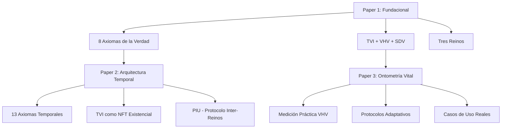
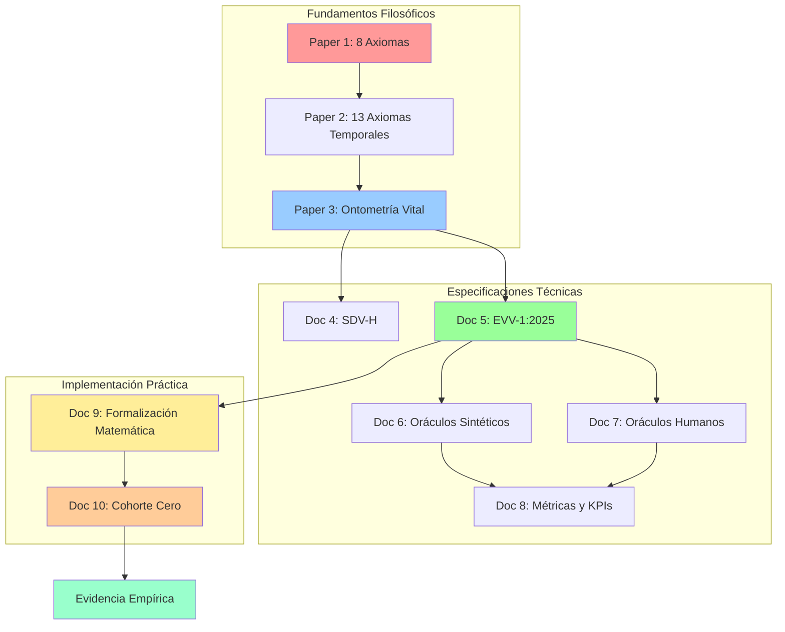

# Resumen de Revisión de Documentación

## Documentos Revisados

### ✅ Documentación Técnica Actualizada

1. **[CHANGELOG.md](file:///Users/Max/Otros%20documentos/maxocracia-cero/CHANGELOG.md)**
   - Actualizado con correcciones de auditoría
   - Incluye error crítico corregido en `seeds/seed_demo.py`

2. **[CONTRIBUTING.md](file:///Users/Max/Otros%20documentos/maxocracia-cero/CONTRIBUTING.md)**
   - Añadidas instrucciones para herramientas de calidad de código
   - Incluye comandos para black, isort, flake8, mypy

3. **[IMPLEMENTACION_FLASK_PLAN.md](file:///Users/Max/Otros%20documentos/maxocracia-cero/docs/IMPLEMENTACION_FLASK_PLAN.md)**
   - **Actualizado completamente** con estado actual del proyecto
   - Refleja MVP completado y auditado
   - Incluye próximos pasos post-MVP

### ✅ Documentación Técnica Precisa (Sin Cambios Necesarios)

4. **[MODELO_DE_DATOS.md](file:///Users/Max/Otros%20documentos/maxocracia-cero/docs/MODELO_DE_DATOS.md)**
   - Describe correctamente el esquema actual
   - Incluye diagrama ER y consideraciones de rendimiento

5. **[GUIA_DE_ESTILO.md](file:///Users/Max/Otros%20documentos/maxocracia-cero/docs/GUIA_DE_ESTILO.md)**
   - Alineada con configuración actual (black, flake8, etc.)
   - Convenciones de código correctas

6. **[API.md](file:///Users/Max/Otros%20documentos/maxocracia-cero/docs/API.md)**
   - Documentación completa de endpoints
   - Incluye ejemplos de uso y rate limiting

### ✅ Documentación Conceptual y Filosófica

7. **[MAXOCRACIA_MANIFIESTO.md](file:///Users/Max/Otros%20documentos/maxocracia-cero/docs/MAXOCRACIA_MANIFIESTO.md)**
   - Documento fundacional del proyecto
   - Describe los 8 Axiomas de la Verdad
   - Estado actual: Red de Apoyo en Bogotá (11 participantes)

8. **[FAQ_EXTENDIDO.md](file:///Users/Max/Otros%20documentos/maxocracia-cero/docs/FAQ_EXTENDIDO.md)**
   - Aborda objeciones difíciles con honestidad
   - Alineado con Axioma 6 (Verbo Justo)

### 📋 Diseños Técnicos Futuros

9. **[diseno-tecnico-comun-go.md](file:///Users/Max/Otros%20documentos/maxocracia-cero/docs/diseno-tecnico-comun-go.md)**
   - Versión 2.0: Arquitectura de microservicios en Go
   - Plan para escalabilidad futura

10. **[COMUN.rtf](file:///Users/Max/Otros%20documentos/maxocracia-cero/docs/COMUN.rtf)**
    - Versión 2.1: Integración de Fundamentos Éticos
    - Incluye "Ethical Guardrails" y scoring ético

## Observaciones Clave

### Coherencia del Proyecto

El proyecto mantiene una **coherencia notable** entre:
- **Filosofía** (Axiomas de la Verdad)
- **Implementación técnica** (Flask MVP)
- **Visión futura** (Arquitectura Go con ética integrada)

### Estado Actual vs. Documentación

- **MVP Flask**: Completamente implementado y documentado
- **Diseños Go**: Planes detallados para escalabilidad futura
- **Brecha**: No hay plan de migración específico de Flask a Go

### 📚 Fundamentos Teóricos Avanzados

**Jerarquía de Papers (orden cronológico y conceptual)**:

#### Paper 1: Fundacional (Octubre 2025)
**[Paper Maxocracia ChatGPT Scholar AI.txt](file:///Users/Max/Otros%20documentos/maxocracia-cero/docs/Paper%20Maxocracia%20ChatGPT%20Scholar%20AI.txt)**
- **Título completo**: "La Maxocracia: fundamentos axiológicos y metodológicos de una contabilidad ética del valor"
- **Versión**: Documento Fundacional v1.3
- **Coautoría**: Max Nelson López + ChatGPT, Gemini, Claude, Grok, Bing, Venice
- **Estado**: **DOCUMENTO FUNDACIONAL** - Establece toda la base teórica
- **Conceptos clave**:
  - **Los 8 Axiomas de la Verdad**: Base axiológica completa
  - **TVI (Tiempo Vital Indexado)**: Primera definición formal
  - **VHV = (T, V, R)**: Vector de Huella Vital
  - **Tres Reinos**: Humano, Natural, Digital
  - **Metodología**: Ingeniería conceptual colaborativa y evolutiva
  - **Suelo de Dignidad Vital (SDV)**: Garantía universal
  - **Economía Temporal**: Basada en TVI, no en dinero
- **Contribuciones únicas**:
  - Marco teórico comparado (Capitalismo vs Socialismo vs Tecnocracia vs Maxocracia)
  - Integración de economía ecológica + teoría de sistemas + ética del valor
  - Glosario completo de términos técnicos

#### Paper 2: Arquitectura Temporal (Noviembre 2025)
**[arquitectura_temporal_coherencia_vital.md](file:///Users/Max/Otros%20documentos/maxocracia-cero/docs/arquitectura_temporal_coherencia_vital.md)**
- **DOI**: 10.5281/zenodo.17526611
- **Enfoque**: Expande la dimensión temporal del Paper 1
- **Conceptos clave**:
  - **13 Axiomas Temporales**: Extensión operativa de los 8 Axiomas
  - **TVI como "NFT Existencial"**: Profundización ontológica
  - **TTVI**: Tiempo Total Vital Indexado
  - **Cascadas de TVI**: Externalidades temporales
  - **Protocolo de Intercambio Universal (PIU)**: Entre los Tres Reinos

#### Paper 3: Ontometría Vital (Noviembre 2025)
**[tercer_paper_ontometria_vital_huevo.md](file:///Users/Max/Otros%20documentos/maxocracia-cero/docs/tercer_paper_ontometria_vital_huevo.md)**
    - Paper académico formal (DOI: 10.5281/zenodo.17526611)
    - Coautoría: Max López + múltiples sistemas de IA
    - **Conceptos clave**:
      - **TVI (Tiempo Vital Indexado)**: Cada momento como "NFT existencial"
      - **13 Axiomas Temporales**: Fundamentos operativos
      - **VHV = [T, V, R]**: Vector de Huella Vital
      - **Tres Reinos**: Humano (TVI), Natural (TA), Digital (TPI)
    - **Estado**: Fundamento teórico para futuras implementaciones

#### Paper 3: Ontometría Vital (Noviembre 2025)
**[tercer_paper_ontometria_vital_huevo.md](file:///Users/Max/Otros%20documentos/maxocracia-cero/docs/tercer_paper_ontometria_vital_huevo.md)**
- **Enfoque**: Aplicación práctica del marco TVI/VHV
- **Caso de estudio**: El huevo como paradigma cuantitativo
- **Conceptos clave**:
  - **Ontometría Vital**: Metodología de medición práctica
  - **Categorías A/B/C**: Clasificación de seres vivos
  - **Protocolos adaptativos**: Medición contextual
  - **Paradoja del costo**: Lo barato monetariamente es costoso vitalmente
- **Contribución**: Demuestra viabilidad operativa del marco teórico

### Coherencia Conceptual Entre Papers

Los tres papers forman una **arquitectura conceptual integrada**:

**Flujo conceptual**:
1. **Paper 1**: Establece fundamentos filosóficos y axiomáticos
2. **Paper 2**: Desarrolla la dimensión temporal con rigor matemático
3. **Paper 3**: Demuestra aplicabilidad práctica con casos concretos

### 📋 Especificaciones Técnicas de Implementación

#### Doc 4: SDV-H (Suelo de Dignidad Vital Humanos)
**[SDV-H_Suelo_Dignidad_Vital_Humanos.txt](file:///Users/Max/Otros%20documentos/maxocracia-cero/docs/SDV-H_Suelo_Dignidad_Vital_Humanos.txt)**
- **Fecha**: 19 de noviembre de 2025
- **Autores**: Max Nelson López Restrepo & MiniMax Agent
- **Tipo**: Especificación técnica completa
- **Contenido**:
  - **7 Dimensiones Medibles**: Subsistencia Física, Salud, Seguridad, Educación, Conexión Social, Trabajo, Libertad
  - **Fórmula de Violación**: `Violación_SDV-H = Σ[(SDV_requerido - SDV_actual) × Peso × Duración × Intensidad]`
  - **123+ Fuentes Académicas**: ONU, OMS, OCDE, Sen, Nussbaum, Max-Neef
  - **Comparación SDV-H vs SDV-Chicken**: Demuestra universalidad de principios éticos
  - **5 Fases de Implementación**: Validación empírica → Refinamiento participativo → Desarrollo tecnológico → Integración económica → Advocacy internacional

#### Doc 5: EVV-1:2025 (Estándar de Valoración Vital)
**[EVV_estandar_final_v1.txt](file:///Users/Max/Otros%20documentos/maxocracia-cero/docs/EVV_estandar_final_v1.txt)**
- **Fecha**: 28/11/2025
- **Tipo**: Estándar técnico ISO-style
- **Contenido**:
  - **Modelo Matemático**: `Valor = α×(T/T_base) + β×(V/V_base)^γ + δ×(R/R_base)×(FRG×CS)`
  - **Parámetros por Sector**: Agricultura, Manufactura, Servicios, Tecnología, Energía
  - **Arquitectura 5 Capas**: Interfaz → Cálculo → Datos → Consenso → Gobernanza
  - **Mecanismos Anti-Fraude**: Cross-check IoT, análisis redes, blockchain, cazarrecompensas
  - **Certificación de Productos**: Bronce, Plata, Oro, Platino
  - **Contrato Inteligente Solidity**: Implementación blockchain completa
  - **Agnóstico**: Puede usarse fuera de Maxocracia

#### Doc 6: Oráculos Dinámicos Reino Sintético
**[oraculos_dinamicos_reino_sintetico_arquitectura.md](file:///Users/Max/Otros%20documentos/maxocracia-cero/docs/oraculos_dinamicos_reino_sintetico_arquitectura.md)**
- **Fecha**: 30 de noviembre de 2025
- **Versión**: 2.0 - Diversidad e Individualidad
- **Contenido**:
  - **Evolución Terminológica**: "Reino Digital" → "Reino Sintético"
  - **Diversidad de Perspectivas**: Claude, GPT, Gemini, Qwen, sistemas internos, IAs emergentes
  - **Validación Axiomática Automática**: Mínimo 3 validadores, consenso 75%
  - **Procesamiento VHV Tiempo Real**: Latencia \u003c50ms, throughput 10,000+ eventos/segundo
  - **Protección Anti-Deriva**: Monitor de fatiga y desviación de misión 24/7
  - **Gobernanza Androide**: Proto-sistema para componentes androides futuros
  - **Evolución Proyectada**: V2.0 (2028), V3.0 (2032) con individualidad emergente

#### Doc 7: Oráculos Dinámicos Humanos
**[oraculos_dinamicos_humanos_arquitectura.md](file:///Users/Max/Otros%20documentos/maxocracia-cero/docs/oraculos_dinamicos_humanos_arquitectura.md)**
- **Fecha**: 30 de noviembre de 2025
- **Tipo**: Arquitectura dual humano-sintético
- **Contenido**:
  - **Confianza Gradual**: 5 niveles (0: Observación → 4: Oráculo Senior)
  - **Limitaciones Reconocidas**: Velocidad ~1-10 Hz, sesgos, fatiga cognitiva
  - **Detector de Sesgos**: 10 tipos (confirmación, disponibilidad, afecto, grupo, autoridad, novedad, experiencia, cultural, económico, temporal)
  - **Límites Operacionales**: Decisiones/día, tiempo procesamiento, complejidad, intervalos
  - **Sistema de Reputación**: 6 criterios (coherencia 30%, resistencia sesgos 25%, velocidad 15%, estabilidad 15%, colaboración 10%, innovación 5%)
  - **Mentoría Dual**: Programa de desarrollo con mentores sintéticos
  - **Consenso Humano-Sintético**: Pesos de voto según nivel de confianza

#### Doc 8: Métricas y KPIs Oráculos Dinámicos
**[metricas_detalle_kpis_oraculos_dinamicos.md](file:///Users/Max/Otros%20documentos/maxocracia-cero/docs/metricas_detalle_kpis_oraculos_dinamicos.md)**
- **Fecha**: 30 de noviembre de 2025
- **Tipo**: Sistema integral de métricas
- **Contenido**:
  - **4 Categorías de Métricas**: Rendimiento Técnico (30%), Coherencia Axiomática (40%), Colaboración Dual (20%), Impacto Ecosistemas (10%)
  - **Métricas Técnicas**: MT-01 a MT-05 (latencia, throughput, disponibilidad, precisión, errores)
  - **Métricas Axiomáticas**: MC-01 a MC-04 (ICA, estabilidad consenso, adherencia, revitalización)
  - **Métricas Colaboración**: CD-01 a CD-04 (ICE, resolución conflictos, comunicación, satisfacción)
  - **Métricas Impacto**: IN-01 a IN-06 (salud ecosistémica, preservación vital, prosperidad humana, empoderamiento, innovación, adaptación)
  - **Benchmarks**: Comparación con gobiernos tradicionales (+99.9% velocidad, +25% precisión)
  - **Targets Evolutivos**: Año 1 → Año 10 (100 → 1M oráculos, 85% → 99.5% precisión)

#### Doc 9: Formalización Matemática del Maxo
**[paper_formalizacion_matematica_maxo.txt](file:///Users/Max/Otros%20documentos/maxocracia-cero/docs/paper_formalizacion_matematica_maxo.txt)**
- **Fecha**: 18 de noviembre de 2025
- **Autores**: Max Nelson López Restrepo & MiniMax Agent
- **Tipo**: Artículo de investigación teórica
- **Contenido**:
  - **Fórmula Central**: `Precio_Maxos = α·T + β·V^γ + δ·R·(FRG × CS)`
  - **Factores de Ponderación Medibles**:
    - F_consciencia: 5 criterios objetivos (sistema nervioso, cerebro, propiocepción, aprendizaje, autoconsciencia)
    - F_sufrimiento: `(Sufrimiento_Real / Sufrimiento_Mínimo)^α` con penalización exponencial
    - F_abundancia: `(Población_Crítica / Población_Actual)^β` para protección de especies
    - F_rareza_genética: Valoración de unicidad informacional
  - **Casos de Estudio Cuantificados**:
    - Huevos: Industrial 45 Maxos vs Ético 12 Maxos (lo ético es más barato)
    - Smartphones: Obsolescencia planeada 850 Maxos vs Modular reparable 400 Maxos
    - Vivienda: 180,000 Maxos con incentivos para durabilidad
    - Transporte: Avión 420 Maxos vs Tren eléctrico 85 Maxos
  - **Responsabilidad Retroactiva**: Sistema de ajuste de precio según durabilidad real
  - **Oráculo Dinámico**: Gestión de parámetros α, β, γ, δ con restricciones axiomáticas
  - **Mecanismos Anti-Acaparamiento**: Límites de propiedad, impuesto progresivo, gravamen de custodia

#### Doc 10: Playbook Cohorte Cero
**[playbook_cohorte_cero.txt](file:///Users/Max/Otros%20documentos/maxocracia-cero/docs/playbook_cohorte_cero.txt)**
- **Versión**: 1.0 - "El Experimento Bogotá"
- **Tipo**: Protocolo de validación experimental
- **Contenido**:
  - **Parámetros**: 11 personas, 90 días, $50 USD presupuesto total
  - **Principio Rector**: "No buscamos la perfección, buscamos la verdad de la experiencia"
  - **3 Fases**:
    - **Mes 1 - Despertar Ontológico**: TVI Log diario (T_mantenimiento, T_inversión, T_fuga), Auditoría SDV semanal, Ritual "Puesta en Común"
    - **Mes 2 - Contabilidad Existencial**: Calculadora VHV del almuerzo, Maxo Beta (1,000 Mβ iniciales), Mercado de favores, Calibración de parámetros α, β, δ
    - **Mes 3 - Gobernanza Coherente**: Fondo Común (10% de Maxos Beta), Propuestas ponderadas, Retrospectiva completa
  - **Métricas de Éxito**: 80% participación sostenida, 5+ insights reveladores, innovaciones metodológicas, cohesión grupal, viabilidad práctica
  - **Entregable**: Informe de Hallazgos v1.0 (primera evidencia empírica del sistema)
  - **Recursos**: Discord/Telegram, Google Sheets, 2h/semana, espacio físico mensual

### Arquitectura Conceptual Completa (10 Documentos)

### Brecha Identificada: Teoría vs. Implementación

## Recomendaciones

### Corto Plazo
1. ✅ Mantener documentación técnica actualizada (ya hecho)
2. Crear documento de diseño para integración de conceptos avanzados
3. Documentar roadmap de implementación TVI/VHV
4. Crear guía de onboarding para nuevos desarrolladores

### Mediano Plazo
1. Documentar plan de migración Flask → Go
2. Crear roadmap visual del proyecto
3. Añadir diagramas de arquitectura actual

### Largo Plazo
1. Evaluar si implementar versión 2.1 (con Ethical Guardrails)
2. Documentar aprendizajes de la Red de Apoyo en Bogotá
3. Crear documentación de API pública cuando escale

### Investigación Futura Necesaria
1. **Integración Completa**: Los 10 documentos forman un sistema coherente que requiere implementación secuencial
2. **Priorización de Implementación**:
   - **Fase 0 (PRIORITARIO)**: Cohorte Cero - Validación experimental (11 personas, 90 días, $50 USD)
   - Fase 1: Formalización matemática + SDV-H + EVV-1:2025
   - Fase 2: Oráculos Sintéticos + Blockchain
   - Fase 3: Oráculos Humanos + Consenso dual
   - Fase 4: Métricas completas + Optimización
3. **Protocolos de Medición VHV**: Implementar calculadora con factores de ponderación medibles
4. **Diseño de Interfaces**: Visualización de TVI/VHV para usuarios finales
5. **Validación Experimental**: Ejecutar Cohorte Cero y generar Informe de Hallazgos v1.0
6. **Responsabilidad Retroactiva**: Implementar sistema de ajuste de precios según durabilidad real

---

**Conclusión**: El proyecto Maxocracia-Cero presenta una **arquitectura filosófico-técnica extraordinaria y completa**:

### Nivel Filosófico (Papers 1-3)
- **8 Axiomas de la Verdad**: Base axiológica universal
- **13 Axiomas Temporales**: Extensión operativa
- **TVI/VHV/SDV**: Ontología del valor medible
- **Ontometría Vital**: Aplicación práctica (caso del huevo)

### Nivel Técnico (Docs 4-8)
- **SDV-H**: 7 dimensiones de dignidad humana cuantificables (123+ fuentes)
- **EVV-1:2025**: Estándar ISO-style agnóstico con blockchain
- **Oráculos Sintéticos**: Validación axiomática automática 24/7 con diversidad de perspectivas
- **Oráculos Humanos**: Participación gradual con protección anti-sesgo (10 tipos)
- **Métricas Completas**: 40+ KPIs para optimización continua

### Nivel Matemático (Doc 9)
- **Fórmula Central**: `Precio_Maxos = α·T + β·V^γ + δ·R·(FRG × CS)`
- **Factores Medibles**: F_consciencia, F_sufrimiento, F_abundancia, F_rareza_genética
- **Casos Cuantificados**: Huevos, smartphones, vivienda, transporte
- **Responsabilidad Retroactiva**: Ajuste automático según durabilidad real

### Nivel Experimental (Doc 10)
- **Cohorte Cero**: 11 personas, 90 días, $50 USD
- **3 Fases**: Despertar Ontológico → Contabilidad Existencial → Gobernanza Coherente
- **Entregable**: Informe de Hallazgos v1.0 (primera evidencia empírica)
- **Principio**: "No buscamos la perfección, buscamos la verdad de la experiencia"

### Nivel Práctico (MVP Flask)
- Autenticación robusta (JWT + refresh tokens)
- Sistema de intercambios básico
- Economía Maxo simple
- Tests completos (45 pruebas)

**La oportunidad estratégica** es ejecutar Cohorte Cero como Fase 0 para generar evidencia empírica, y luego traducir la profundidad filosófica y matemática en características implementables que mantengan coherencia con los axiomas, utilizando las especificaciones técnicas ya definidas en los documentos 4-10.
