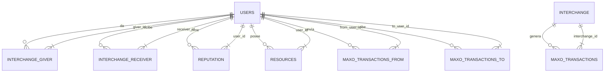

# Modelo de Datos de Maxocracia

Este documento describe el modelo de datos utilizado en la aplicación Maxocracia, incluyendo las tablas de la base de datos, sus relaciones y campos.

## Tablas Principales

### Usuarios (`users`)

Almacena la información de los usuarios del sistema.

| Campo | Tipo | Descripción |
|-------|------|-------------|
| `id` | INTEGER | Identificador único (clave primaria) |
| `email` | VARCHAR(120) | Correo electrónico (único) |
| `password_hash` | VARCHAR(128) | Hash de la contraseña |
| `name` | VARCHAR(100) | Nombre completo del usuario |
| `alias` | VARCHAR(50) | Alias o nombre de usuario (opcional) |
| `created_at` | DATETIME | Fecha de creación del usuario |
| `last_login` | DATETIME | Último inicio de sesión |

### Intercambios (`interchange`)

Registra los intercambios entre usuarios.

| Campo | Tipo | Descripción |
|-------|------|-------------|
| `id` | INTEGER | Identificador único (clave primaria) |
| `interchange_id` | VARCHAR(36) | UUID del intercambio |
| `giver_id` | INTEGER | ID del usuario que da (clave foránea a users.id) |
| `receiver_id` | INTEGER | ID del usuario que recibe (clave foránea a users.id) |
| `description` | TEXT | Descripción del intercambio |
| `uth_hours` | FLOAT | Horas de Unidad de Tiempo Humano |
| `uvc_score` | FLOAT | Puntuación de Unidad de Vida Consumida |
| `urf_units` | FLOAT | Unidades de Recursos Finitos |
| `vhv_time_seconds` | FLOAT | Componente de tiempo del Vector de Huella Vital (segundos) |
| `vhv_lives` | FLOAT | Componente de vidas del Vector de Huella Vital |
| `vhv_resources_json` | TEXT | Componente de recursos del Vector de Huella Vital (JSON) |
| `impact_resolution_score` | INTEGER | Puntuación de impacto/resolución (1-10) |
| `created_at` | DATETIME | Fecha de creación del registro |

### Reputación (`reputation`)

Almacena las calificaciones de reputación de los usuarios.

| Campo | Tipo | Descripción |
|-------|------|-------------|
| `id` | INTEGER | Identificador único (clave primaria) |
| `user_id` | INTEGER | ID del usuario calificado (clave foránea a users.id) |
| `rater_id` | INTEGER | ID del usuario que califica (clave foránea a users.id) |
| `score` | INTEGER | Puntuación (1-5) |
| `comment` | TEXT | Comentario opcional |
| `created_at` | DATETIME | Fecha de la calificación |

### Recursos (`resources`)

Registra los recursos compartidos en la plataforma.

| Campo | Tipo | Descripción |
|-------|------|-------------|
| `id` | INTEGER | Identificador único (clave primaria) |
| `user_id` | INTEGER | ID del usuario propietario (clave foránea a users.id) |
| `title` | VARCHAR(100) | Título del recurso |
| `description` | TEXT | Descripción detallada |
| `category` | VARCHAR(50) | Categoría del recurso |
| `status` | VARCHAR(20) | Estado (disponible, prestado, en reparación, etc.) |
| `created_at` | DATETIME | Fecha de creación |
| `updated_at` | DATETIME | Última actualización |

### Transacciones de Maxo (`maxo_transactions`)

Registra las transacciones de la moneda Maxo.

| Campo | Tipo | Descripción |
|-------|------|-------------|
| `id` | INTEGER | Identificador único (clave primaria) |
| `transaction_id` | VARCHAR(36) | UUID de la transacción |
| `from_user_id` | INTEGER | ID del usuario origen (NULL si es emisión) |
| `to_user_id` | INTEGER | ID del usuario destino |
| `amount` | DECIMAL(18,8) | Cantidad de Maxo transferida |
| `reason` | TEXT | Razón de la transacción |
| `interchange_id` | INTEGER | ID del intercambio relacionado (opcional) |
| `created_at` | DATETIME | Fecha de la transacción |

## Relaciones

- Un Usuario puede tener muchos Intercambios (como dador o receptor)
- Un Usuario puede tener muchas Calificaciones de Reputación
- Un Usuario puede tener muchos Recursos
- Un Usuario puede tener muchas Transacciones de Maxo (como origen o destino)
- Un Intercambio puede estar relacionado con una Transacción de Maxo

## Diagrama de Entidad-Relación



## Consideraciones de Rendimiento

- Se han creado índices en las claves foráneas para optimizar las consultas.
- Los campos de búsqueda frecuente (como `email` en `users`) están indexados.
- Se utiliza JSON para almacenar datos semiestructurados en `vhv_resources_json`.

## Migraciones

El proyecto utiliza un sistema de migraciones para gestionar los cambios en el esquema de la base de datos. Las migraciones se encuentran en el directorio `migrations/`.

Para crear una nueva migración:

```bash
flask db migrate -m "Descripción del cambio"
```

Para aplicar las migraciones pendientes:

```bash
flask db upgrade
```

## Copias de Seguridad

Se recomienda realizar copias de seguridad periódicas de la base de datos. Puedes usar el siguiente comando para SQLite:

```bash
sqlite3 instance/maxocracia.db ".backup 'backup_$(date +%Y%m%d_%H%M%S).db'"
```

## Notas de Implementación

- Todas las fechas se almacenan en UTC.
- Las transacciones monetarias utilizan precisión decimal para evitar problemas de redondeo.
- Las contraseñas nunca se almacenan en texto plano, solo hashes seguros.
