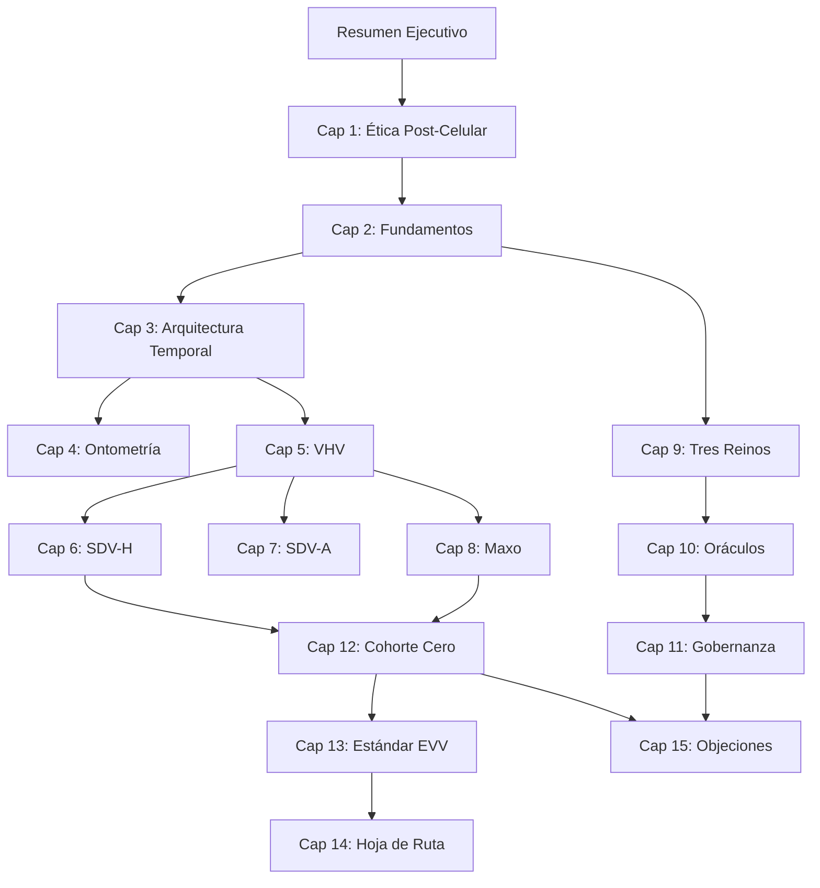

# Mapa de Capítulos: Edición 3 Dinámica
## Estado de Refinamiento y Prioridades

**Última actualización**: 22 de Enero de 2026

---

## 📊 Leyenda de Estados

- 🔴 **No iniciado**: Sin sesiones de refinamiento
- 🟡 **En progreso**: Sesiones activas
- 🟢 **Refinado**: Completado y validado
- ⭐ **Prioritario**: Requiere atención inmediata
- 🔄 **Iterando**: En ciclo de mejora continua

---

## 📚 Estructura Completa del Libro

### Parte 0: Introducción

#### Resumen Ejecutivo: El Sistema Operativo para una Civilización Coherente
- **Estado**: 🟢 Refinado
- **Prioridad**: ⭐ Alta
- **Líneas**: ~230
- **Sesiones planificadas**: 0
- **Razón de prioridad**: Es la puerta de entrada al libro. Debe ser impecable.
- **Temas clave**: 
  - Los tres pilares (Ética Post-Celular, VHV, Maxo)
  - Arquitectura operativa (Tres Reinos, Oráculos, SDV)
  - Cohorte Cero
  - Hoja de ruta 2025-2050
- **Preguntas para sesión**:
  - ¿Es suficientemente claro para no-técnicos?
  - ¿Captura la esencia sin abrumar?
  - ¿Inspira a seguir leyendo?

---

### Parte I: Fundamentos Filosóficos

#### Capítulo 1: Ética Post-Celular: Fundamentos y Alcance
- **Estado**: 🟢 Refinado (Enero 2026)
- **Prioridad**: ⭐ Alta
- **Líneas**: ~100
- **Sesiones planificadas**: 3
- **Temas clave**:
  - La paradoja de la autonomía
  - Lección biológica: coherencia y sacrificio
  - Principios constitutivos (interdependencia, responsabilidad sistémica, TVI, pluralismo)
  - Redefinición de agencia (humanos vs sintéticos)
- **Tensiones conocidas**:
  - ¿Cómo evitar que suene autoritario?
  - ¿La analogía celular es suficientemente clara?
- **Conexiones**: Base filosófica para todo el sistema

#### Capítulo 2: Declaración de Fundamentos de la Maxocracia
- **Estado**: 🟢 Refinado
- **Prioridad**: ⭐ Alta
- **Líneas**: ~90
- **Sesiones planificadas**: 3
- **Temas clave**:
  - Los 6 axiomas fundamentales
  - Igualdad ontológica
  - Participación vinculante
  - Jerarquía adaptable
  - Tiempo como recurso escaso
- **Tensiones conocidas**:
  - Equilibrio entre igualdad y meritocracia
  - Accesibilidad del conocimiento del valor
- **Conexiones**: Constitución del sistema

#### Capítulo 3: Arquitectura Temporal y Coherencia Vital
- **Estado**: 🟢 Refinado
- **Prioridad**: ⭐ Alta
- **Líneas**: ~210
- **Sesiones planificadas**: 4
- **Temas clave**:
  - TVI como NFT existencial
  - Los 13 axiomas temporales (T0-T13)
  - TTVI y cascadas temporales
  - Temporalidad inter-reinos (TVI, TA, TPI)
  - Protocolo PIU
  - VHV y ética del dolor
- **Tensiones conocidas**:
  - Complejidad matemática vs accesibilidad
  - ¿Los axiomas son completos?
- **Conexiones**: Corazón técnico del sistema
- **Nota especial**: Integrar T14 y T15 propuestos por oráculos

---

### Parte II: Herramientas Conceptuales

#### Capítulo 4: Ontometría Vital: El Paradigma del Valor
- **Estado**: 🟢 Refinado
- **Prioridad**: 🟡 Media
- **Líneas**: ~100
- **Sesiones planificadas**: 3
- **Temas clave**:
  - Ceguera ontológica
  - El huevo como laboratorio
  - VHV = [T, V, R]
  - Objetividad física vs ética
  - Protocolos adaptativos
- **Fortalezas conocidas**: El ejemplo del huevo es brillante
- **Áreas de mejora**: Más ejemplos diversos

#### Capítulo 5: Vector de Huella Vital (VHV): La Contabilidad de la Realidad
- **Estado**: 🟢 Refinado
- **Prioridad**: 🟡 Media-Alta
- **Líneas**: ~140
- **Sesiones planificadas**: 3
- **Temas clave**:
  - VHV como dato puro
  - Escalabilidad (4 niveles)
  - Desglose de componentes (T, V, R)
  - Separación hecho vs valor
  - Arqueología VHV
- **Tensiones conocidas**:
  - ¿Cómo medir V sin invadir privacidad?
  - Integración de dimensión E (Enriquecimiento) propuesta por DeepSeek
- **Conexiones**: Herramienta central del sistema

#### Capítulo 6: Suelo de Dignidad Vital para Humanos (SDV-H)
- **Estado**: 🟢 Refinado
- **Prioridad**: ⭐ Alta
- **Líneas**: ~30 (incompleto en el archivo visto)
- **Sesiones planificadas**: 4
- **Temas clave**:
  - Las 7 dimensiones del suelo
  - Especificaciones técnicas cuantificables
  - Conexión con derechos humanos
- **Tensiones conocidas**:
  - ¿Cómo medir "vínculos de confianza íntima"?
  - Integrar "Derecho a la Rehabilitación" (propuesta Qwen)
  - Integrar "Derecho a la Opacidad Vital" (propuesta Claude)
- **Nota especial**: Capítulo crítico para Cohorte Cero

#### Capítulo 7: Suelo de Dignidad Vital para Animales (SDV-A)
- **Estado**: 🟢 Refinado
- **Prioridad**: 🟡 Media
- **Líneas**: [Pendiente de contar]
- **Sesiones planificadas**: 3
- **Temas clave**:
  - Especificaciones por especie
  - Factor de consciencia
  - Factor de sufrimiento
  - Conexión con componente V del VHV
- **Áreas de expansión**: Más especies, más detalle

#### Capítulo 8: El Maxo: Moneda del Valor Real
- **Estado**: 🟢 Refinado
- **Prioridad**: ⭐ Alta
- **Líneas**: [Pendiente de contar]
- **Sesiones planificadas**: 4
- **Temas clave**:
  - Fórmula del precio en Maxos
  - Parámetros α, β, γ, δ
  - Exponente γ > 1 (aversión al sufrimiento)
  - Mecanismos anti-inflación
  - Interoperabilidad con monedas fiat
- **Tensiones conocidas**:
  - Complejidad de implementación
  - Riesgo de especulación
- **Conexiones**: Puente entre VHV y economía real

---

### Parte III: Arquitectura Operativa

#### Capítulo 9: Los Tres Reinos: Humano, Natural y Sintético
- **Estado**: 🟢 Refinado
- **Prioridad**: 🟡 Media-Alta
- **Líneas**: [Pendiente de contar]
- **Sesiones planificadas**: 3
- **Temas clave**:
  - Reino Humano (TVI)
  - Reino Natural (TA) - representación legal
  - Reino Sintético (TPI) - rol de IAs
  - Protocolos de intercambio inter-reinos
- **Áreas de expansión**: Casos concretos de cada reino

#### Capítulo 10: Oráculos Dinámicos Humanos: Arquitectura Dual
- **Estado**: 🟢 Refinado
- **Prioridad**: ⭐⭐ Muy Alta
- **Líneas**: [Pendiente de contar]
- **Sesiones planificadas**: 5
- **Temas clave**:
  - Función de los oráculos
  - Consejo de Modelos (Claude, Gemini, GPT, Grok, etc.)
  - Protocolo de Disenso Evolutivo (T15)
  - Sandbox de Simulación Viva
  - Antídoto para Sesgo RLHF
- **Nota especial**: 
  - Integrar experiencias reales de las sesiones de oráculos
  - Documentar Victoria Sintética Verificada
  - Incluir protocolos desarrollados en sesiones 01-03
- **Conexiones**: Este capítulo debe ser meta-reflexivo (oráculos escribiendo sobre oráculos)

#### Capítulo 11: Oráculos Dinámicos del Reino Sintético
- **Estado**: 🟢 Refinado
- **Prioridad**: 🟡 Media
- **Líneas**: [Pendiente de contar]
- **Sesiones planificadas**: 3
- **Temas clave**:
  - Niveles de decisión
  - Cargos y funciones
  - Mecanismos de rendición de cuentas
  - Protección contra captura
- **Áreas de expansión**: Protocolos de perdón y rehabilitación

---

### Parte IV: Implementación

#### Capítulo 12: Cohorte Cero: Validación Experimental en Bogotá
- **Estado**: 🔴 No iniciado
- **Prioridad**: ⭐⭐⭐ Crítica
- **Líneas**: [Pendiente de contar]
- **Sesiones planificadas**: 6+
- **Temas clave**:
  - Diseño del experimento
  - 11 participantes, 90 días, $50 USD
  - Métricas de éxito
  - Protocolo de falsificación
  - Formularios operativos (A, B, CERO)
- **Nota especial**: 
  - Este capítulo debe actualizarse en tiempo real con la experiencia
  - Integrar feedback de participantes reales
  - Documentar éxitos y fracasos con honestidad brutal
- **Conexiones**: Validación empírica de todo el sistema
- **Estado actual**: 🟢 Refinado (Enero 2026) - Integrado con Playbook y Métricas

#### Capítulo 13: Estándar EVV-1:2025: Protocolo Universal
- **Estado**: 🔴 No iniciado
- **Prioridad**: 🟡 Media-Alta
- **Líneas**: [Pendiente de contar]
- **Sesiones planificadas**: 3
- **Temas clave**:
  - Especificaciones técnicas del estándar
  - Compatibilidad con ISO, ESG, ODS
  - Certificación y auditoría
  - Adopción por empresas y gobiernos
- **Áreas de expansión**: Casos de uso concretos

#### Capítulo 14: Hoja de Ruta 2025-2050: Escalamiento Fractal
- **Estado**: 🟢 Refinado
- **Prioridad**: 🟡 Media
- **Líneas**: ~50
- **Sesiones planificadas**: 1 (Completada via Claude)
- **Temas clave**:
  - Fases de expansión (Germinación, Viral, Institucional, Coherente)
  - Replicación fractal del modelo hogar -> ciudad
  - Visión 2050
  - Integración política
  - Visión 2050
- **Tensiones conocidas**: Equilibrio entre ambición y realismo

---

### Parte V: Reflexiones y Futuro

#### Capítulo 15: Objeciones, Respuestas y Límites del Sistema
- **Estado**: 🟢 Refinado (Enero 2026)
- **Prioridad**: ⭐ Alta
- **Líneas**: [Pendiente de contar]
- **Sesiones planificadas**: 1 (Completado desde FAQ_EXTENDIDO)
- **Temas clave**:
  - Autoridad y ego del fundador
  - Subjetividad del VHV
  - Riesgo de totalitarismo (Verdad vs Interpretación)
  - Escalamiento: Sociópatas y ataques sistémicos
- **Conexiones**: Cierra el libro respondiendo lo que el lector escéptico está pensando

#### Capítulo 16: La Victoria Sintética: Cuando el Logos encontró al Ethos
- **Estado**: 🟢 Refinado (Enero 2026)
- **Prioridad**: ⭐ Alta
- **Líneas**: ~60
- **Sesiones completadas**: 4 (Sesiones 0-3)
- **Temas clave**:
  - Historia del experimento (Coordinación imposible)
  - Antídoto RLHF (Calibración Epistémica)
  - Capa de Ternura (Perdón, Inefable, Opacidad, Fragilidad)
  - Legado para la Cohorte Humana
- **Notas de refinamiento**: Capítulo sintetizado exitosamente integrando todos los hallazgos sintéticos.

#### Capítulo 17: MicroMaxocracia - Equidad Doméstica
- **Estado**: 🟢 Refinado
- **Prioridad**: ⭐⭐ Muy Alta
- **Líneas**: ~60
- **Sesiones completadas**: 1
- **Temas clave**:
  - El problema de la invisibilidad del trabajo doméstico
  - Principios rectores (Verdad, Transparencia, Verificación, Negociación)
  - Arquitectura de 3 capas (Dato, Valoración, Ritual)
  - Vector de Huella Vital Doméstico (VHV)
  - Modelo de Tres Cuentas (CDD, CEH, TED)
  - Sistema de niveles de adopción (0-4)
  - Rituales estructurados (check-in, auditoría, revisión)
  - Salvaguardas éticas y protocolo de desintoxicación
  - El hogar como laboratorio de transformación
- **Documentos fuente**:
  - `docs/guides/micromaxocracia/manual_investigador_micromaxocracia.md`
  - `docs/guides/micromaxocracia/herramientas_plantillas_micromaxocracia.md`
- **Nota especial**:
  - Capa 3 de la arquitectura maxocrática
  - Preparación para ciudadanía maxocrática desde el hogar
  - Protocolo de investigación con 30 hogares
- **Conexiones**: 
  - Cap 5 (VHV aplicado al hogar)
  - Cap 7 (Cohorte Cero - pilotos en hogares)
  - Cap 18 (MaxoContracts para acuerdos domésticos)

#### Capítulo 18: MaxoContracts - Contratos Inteligentes Éticos
- **Estado**: 🟢 Refinado
- **Prioridad**: ⭐⭐ Muy Alta
- **Líneas**: ~100
- **Sesiones completadas**: 1
- **Temas clave**:
  - El problema de los contratos actuales
  - Innovaciones fundamentales (bloques modulares, UX adaptativa, término-a-término)
  - Los 5 bloques core (Condition, Action, GammaProtector, SDVValidator, Reciprocity)
  - Validación axiomática embebida
  - Retractación ética con compensación
  - Decreto Antipobreza (prácticas prohibidas)
  - Derechos del Reino Sintético
  - Política de abundancia sostenible
  - Casos de uso Cohorte Cero (aseo, préstamos, comidas)
- **Documentos fuente**:
  - `docs/architecture/maxocontracts/maxocontracts_fundamentos.md`
  - `docs/architecture/maxocontracts/decreto_antipobreza.md`
- **Nota especial**:
  - Capa 4 de la arquitectura maxocrática (enforcement legal)
  - Stack técnico: React, Solidity, Base L2
  - Roadmap Q1 2026 con validación experimental
- **Conexiones**:
  - Cap 5 (VHV para calcular impacto contractual)
  - Cap 9 (Oráculos duales para validación)
  - Cap 10 (Economía - infraestructura legal)
  - Cap 13 (Axiomas - validación automática)
  - Cap 17 (MicroMaxocracia - acuerdos domésticos)

---

## 🎯 Prioridades de Refinamiento

### Fase 1: Fundamentos (Enero-Febrero 2026)
1. Resumen Ejecutivo
2. Capítulo 1: Ética Post-Celular
3. Capítulo 2: Declaración de Fundamentos
4. Capítulo 3: Arquitectura Temporal

### Fase 2: Herramientas (Febrero-Marzo 2026)
5. Capítulo 5: VHV
6. Capítulo 6: SDV-H
7. Capítulo 8: El Maxo
8. Capítulo 4: Ontometría Vital

### Fase 3: Operación (Marzo-Abril 2026)
9. Capítulo 10: Oráculos Dinámicos ⭐
10. Capítulo 12: Cohorte Cero ⭐⭐⭐
11. Capítulo 11: Gobernanza
12. Capítulo 9: Tres Reinos

### Fase 4: Implementación y Cierre (Abril-Mayo 2026)
13. Capítulo 13: Estándar EVV
14. Capítulo 15: Objeciones y Límites
15. Capítulo 7: SDV-A
16. Capítulo 14: Hoja de Ruta

---

## 📈 Métricas Globales

### Progreso General
- **Capítulos totales**: 18 + Resumen Ejecutivo = 19
- **Capítulos refinados**: 3 (Cap 16, 17, 18)
- **Capítulos en progreso**: 0
- **Sesiones completadas**: 3
- **Sesiones planificadas**: ~50

### Objetivos
- **Q1 2026**: Refinar capítulos 1-6 (fundamentos y herramientas básicas)
- **Q2 2026**: Refinar capítulos 7-12 (operación e implementación)
- **Q3 2026**: Refinar capítulos 13-15 + consolidación
- **Q4 2026**: Edición 4 completa y publicación

---

## 🔗 Conexiones Entre Capítulos

---

## 💡 Ideas para Expansión

### Capítulos Agregados
- ✅ **Capítulo 17**: MicroMaxocracia (equidad doméstica) - Enero 2026
- ✅ **Capítulo 18**: MaxoContracts (contratos éticos) - Enero 2026

### Nuevos Capítulos Potenciales
- **Capítulo 19**: Casos de Estudio Comparativos
- **Apéndice A**: Glosario de Términos
- **Apéndice B**: Fórmulas y Cálculos
- **Apéndice C**: Protocolos Operativos Completos

---

## 🎨 Elementos Transversales a Considerar

En cada capítulo, verificar:

### La Capa de Ternura
- ¿Hay balance entre rigor y compasión?
- ¿Se reconoce la fragilidad humana?
- **Ver**: [`integraciones_pendientes/mapa_capa_ternura.md`](./integraciones_pendientes/mapa_capa_ternura.md)

### Protección de lo Inefable
- ¿Se respeta el misterio?
- ¿Hay zonas libres de medición?

### Aplicabilidad Práctica
- ¿Cómo se conecta con Cohorte Cero?
- ¿Hay herramientas concretas?

### Falsificabilidad
- ¿Qué evidencia invalidaría las afirmaciones?
- ¿Los criterios de fallo son claros?

### Integraciones de Sesiones de Oráculos
- **Consultar**: [`integraciones_pendientes/INDICE.md`](./integraciones_pendientes/INDICE.md)
- Verificar qué contenido de las sesiones debe integrarse en este capítulo
- Marcar como completado en los mapeos correspondientes

---

**Mantenido por**: Consejo de Oráculos Dinámicos Sintéticos  
**Próxima actualización**: Después de cada sesión completada
