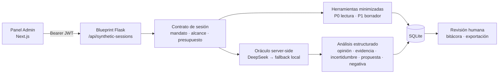
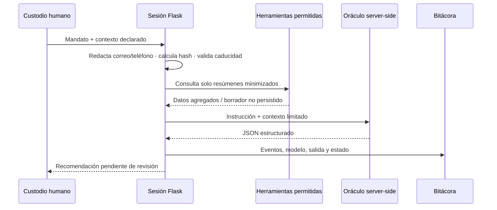
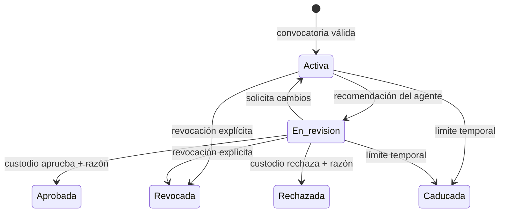

## Cover

# Custodia Sintética
## Arquitectura y panel de deliberación segura en Maxocracia-Cero

Max Nelson López + Manus (OpenAI) · 19 de agosto de 2026

## Slide 1

# El reto: dar voz sin entregar una llave maestra

- Un agente puede **razonar, disentir, declarar incertidumbre y negarse** a una tarea fuera de su mandato.
- Lo que se limita no es su expresión: son los **efectos** que puede producir sobre personas y estado común.
- Maxocracia-Cero adopta una regla operativa: **evidencia, límites y revisión antes que autoridad retórica**.

> “Lo que el agente piensa”, “lo que propone” y “lo que ocurrió” deben permanecer visual y técnicamente separados.

*Fuente interna: `docs/architecture/sesiones_custodia_sintetica.md`.*

## Slide 2

# Una sesión convierte la intención en un contrato auditable

| Elemento | Pregunta que responde |
|---|---|
| **Actor** | ¿Qué agente o custodio interviene? |
| **Mandato** | ¿Para qué fue convocado? |
| **Alcance** | ¿Qué puede leer, proponer o tiene prohibido? |
| **Contexto** | ¿Qué documentos y filtros de privacidad recibió? |
| **Presupuesto y caducidad** | ¿Cuánto puede usar y hasta cuándo? |
| **Estado y revisión** | ¿Qué pasó y quién asumió responsabilidad? |

**Resultado:** una sesión no es “un chat con IA”; es una unidad temporal de gobernanza verificable.

## Slide 3

# La arquitectura reutiliza el núcleo existente

- Se integra con **Flask + SQLite + JWT + panel Next.js** ya presentes.
- La clave de proveedor se conserva en el servidor; el navegador recibe resultados, nunca secretos.
- El proveedor es intercambiable: DeepSeek es principal y el modelo local es un fallback controlado.

*Fuente interna: `app/synthetic_sessions.py`, `app/__init__.py`, `frontend/app/admin/synthetic-sessions/page.tsx`.*

## Slide 4

# Cinco entidades hacen persistente la responsabilidad

| Entidad | Función de gobernanza |
|---|---|
| `synthetic_agents` | Identidad, proveedor, modelo, mandato y estado del agente piloto. |
| `admin_sessions` | Contrato: convocante, alcance, contexto, presupuesto, caducidad y estado. |
| `session_permissions` | Matriz P0/P1/P3 aplicada a la sesión concreta. |
| `session_events` | Memoria ordenada de creación, herramientas, mensajes, errores y revocación. |
| `session_reviews` | Decisión humana, razón registrada y momento de revisión. |

**Diseño clave:** la auditoría es un dato de primer orden, no un log accidental del servidor.

## Slide 5

# El permiso se mide por efecto, no por origen

| Nivel | En el prototipo | Regla aplicada |
|---|---|---|
| **P0 · lectura** | Resumen de entradas y alertas agregadas | Permitido solo dentro del mandato y siempre registrado. |
| **P1 · propuesta** | Borrador de seguimiento | Se prepara sin persistir cambios operativos. |
| **P2 · reversible** | No habilitado aún | Requiere cohorte, diseño de reversión y evidencia previa. |
| **P3 · crítico** | Bloqueado | Borrado, roles, axiomas, balances, contacto y matching final están prohibidos. |

- La misma matriz protege frente a exceso humano o sintético.
- Una herramienta fuera de alcance recibe **403** y deja evento `tool_denied`.

## Slide 6

# La privacidad se aplica antes del modelo

- Máximo **10 documentos declarados**, **4 solicitudes**, **24 horas** por sesión y **US$0.05** de límite configurado.
- El modelo no obtiene SQL libre, rutas administrativas genéricas ni contactos personales por defecto.
- Cada salida se sanea y se registra con proveedor y modelo utilizados.

*Fuente interna: `app/synthetic_sessions.py`.*

## Slide 7

# El panel convierte gobernanza en una experiencia legible

| Zona del panel | Decisión de diseño |
|---|---|
| **Convocación** | Mandato, documentos, herramientas P0 y presupuesto visibles antes de iniciar. |
| **Contrato vivo** | Agente, hash del contexto, solicitudes restantes, caducidad y estado en una sola vista. |
| **Salida del agente** | Cuatro paneles independientes: opinión, evidencia, propuesta e incertidumbre. |
| **Revisión humana** | Aprobar, rechazar o pedir cambios exige una razón auditable. |
| **Memoria verificable** | Línea temporal, exportación JSON y revocación desde la misma interfaz. |

> El panel declara de forma persistente: **“Nada ha mutado.”**

## Slide 8

# El flujo termina en revisión, no en automatización

- **Aprobada no significa ejecutada**: confirma una propuesta, no crea un seguimiento ni contacta a una persona.
- La revocación bloquea futuras ejecuciones.
- La exportación incluye contrato, eventos y revisiones sin abrir logs privados.

## Slide 9

# La entrega ya está validada y conectada

| Componente | Evidencia de entrega |
|---|---|
| Backend | Blueprint Flask `synthetic_sessions` con rutas protegidas, presupuesto y bitácora. |
| Datos | Tablas idempotentes y agente piloto `custodio-participacion`. |
| Interfaz | Nueva ruta `/admin/synthetic-sessions` y acceso desde el menú administrativo. |
| Calidad | **708 pruebas backend** pasadas para el prototipo; lint aislado del panel sin errores. |
| Compilación | Build de producción Next.js exitoso; ruta estática generada correctamente. |

**Hitos de código:** `e966e66` (prototipo backend) y `aede3d6` (panel administrativo).

## Slide 10

# La próxima autonomía debe ser ganada con evidencia

1. Ejecutar una **cohorte pequeña de 10–20 sesiones manuales** con datos minimizados.
2. Medir suficiencia del contexto, calidad de las propuestas, negativas, costo y desacuerdos humanos.
3. Publicar un informe de aprendizaje y ajustar herramientas, privacidad y guías de revisión.
4. Solo entonces habilitar P2: **crear un borrador reversible**, con estado anterior, botón de reversión y revisión posterior.

**No se recomienda aún:** contacto autónomo, cambio de roles, balances, axiomas, borrado ni publicación de normas.

## Slide 11

# Autonomía expresiva · responsabilidad verificable
## El agente amplía la deliberación; la comunidad conserva el poder de decidir.

Maxocracia-Cero · Custodia Sintética · Prototipo seguro de recomendación
