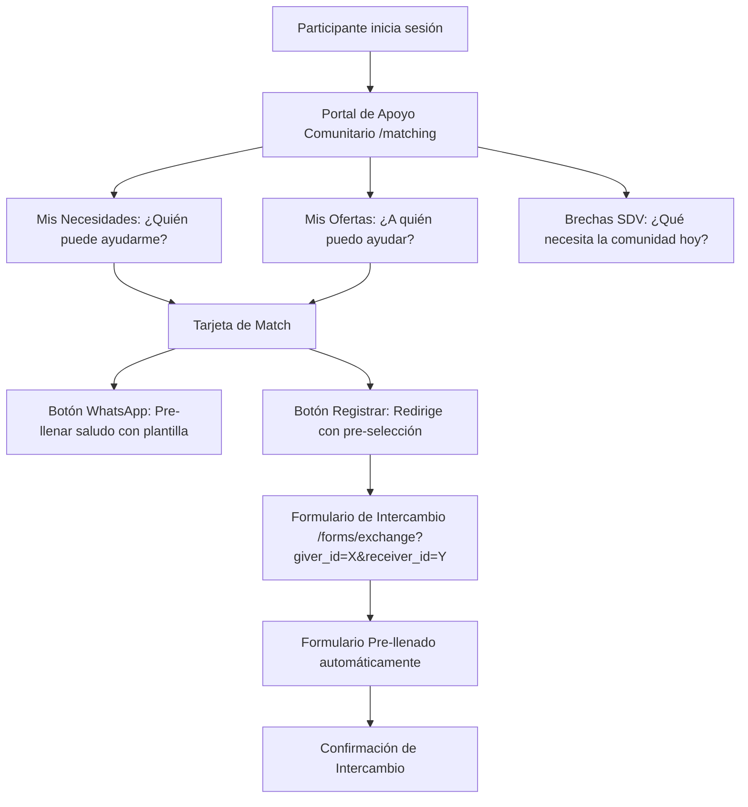

# Plan de Implementación de UX para el Motor de Matching

Este documento establece la visión estratégica y el plan de implementación para la próxima misión de desarrollo, con el objetivo de convertir el motor de matching de un panel administrativo a una herramienta de empoderamiento comunitario directa y fluida para los participantes de la **Cohorte Cero**.

---

## 1. Filosofía de Diseño: Primeros Principios (First Principles)

La **Maxocracia** sostiene que la riqueza y la estabilidad comunitaria se miden en tiempo de vida digna (TVI) y en la cobertura del Suelo de Dignidad Vital (SDV). Por tanto, la experiencia de usuario (UX) no debe ser simplemente un "tablero de control", sino un **catalizador de relaciones humanas**.

### Fricciones Actuales Detectadas:
1. **Coordinación Centralizada (Top-down):** El panel de matching es accesible únicamente para el administrador. Los participantes reales no conocen sus coincidencias ni cómo pueden ayudar a otros a menos que un administrador se los comunique.
2. **Flujo de Registro Desconectado:** El botón "Registrar intercambio" en las tarjetas de matching envía al usuario al formulario de intercambio (`/forms/exchange`), pero este no captura los parámetros de la URL para pre-seleccionar al emisor (`giver`) o receptor (`receiver`), obligando a buscar manualmente y rellenar datos.
3. **Métricas Abstractas:** Los porcentajes de las brechas del SDV son comprensibles a nivel macro, pero no se traducen en llamadas de acción directa para el participante ("¿Qué puedo hacer yo hoy para cerrar la brecha de *Alimentación*?").

---

## 2. Visión del Flujo Peer-to-Peer Completo

---

## 3. Próximo Objetivo: "Conectando la Red de Apoyo"

Proponemos estructurar la próxima misión en torno a cuatro pilares UX para optimizar la fluidez de interacción:

### Pilar A: Formulario de Intercambio Inteligente e Integrado
* **Acción:** Modificar el formulario `/forms/exchange` para que acepte parámetros en la URL (`giver_id`, `receiver_id`, `type`, `description`, `urgency`).
* **Comportamiento:** Si se detectan estos parámetros en la carga de la página, el frontend consultará los nombres de los participantes y pre-seleccionará automáticamente al emisor y receptor en el buscador (`ParticipantSearch`), saltando directamente al paso de métricas y reduciendo los clics a menos de la mitad.

### Pilar B: Portal de Apoyo Comunitario (Vista del Participante)
* **Acción:** Crear la página `/matching` para participantes normales (fuera del panel `/admin`).
* **Secciones Clave:**
  1. **"¿Quién puede darme una mano?":** Muestra matches personalizados para las necesidades activas del usuario logueado.
  2. **"¿A quién puedo ayudar hoy?":** Muestra qué miembros de la comunidad tienen necesidades urgentes que coinciden con lo que el usuario ofrece.
  3. **"Salud del Suelo Vital de la Comunidad":** Un termómetro visual de las 8 dimensiones del SDV. Si una dimensión (ej. *Conexión Social*) está en déficit, se muestra un mensaje: *"Estamos cortos en actividades grupales o apoyo emocional esta semana. ¿Tienes algo que ofrecer aquí?"* con un botón para editar su oferta directamente.

### Pilar C: Puentes de Comunicación de Un Solo Clic
* **Acción:** Integrar botones de acción en las tarjetas de match con generadores de mensajes para WhatsApp y Telegram.
* **Mensajes Dinámicos:**
  * **Si yo necesito ayuda:** *"Hola [Nombre del Oferente], vi en Maxocracia que ofreces apoyo en [Categoría] y yo actualmente tengo una necesidad con eso. ¿Te queda bien que coordinemos un momento esta semana? Un abrazo."*
  * **Si yo ofrezco ayuda:** *"Hola [Nombre del Buscador], vi en Maxocracia que tienes una necesidad de [Categoría]. Yo tengo una oferta activa para esto y me encantaría darte una mano. Cuéntame si coordinamos. ¡Saludos!"*
* **Impacto:** Elimina la barrera de "iniciar la conversación" (el hielo social), haciendo el proceso extremadamente fluido.

### Pilar D: Gamificación Solidaria (Termómetro SDV Comunitario)
* **Acción:** Diseñar un widget público que muestre la cobertura del Suelo de Dignidad Vital colectiva.
* **Filosofía:** En lugar de competir por dinero, la comunidad coopera por la estabilidad de su suelo vital. El éxito se define cuando todas las dimensiones de la Cohorte Cero alcancen $\ge 100\%$.

---

## 4. Plan de Trabajo Técnico Estimado

1. **Sprint 1 (Backend & Conectores):**
   - Habilitar en la API de `/forms/exchange` o endpoints de participantes la búsqueda rápida por ID de participante.
   - Refactorizar el formulario del frontend `/frontend/app/forms/exchange/page.tsx` para usar `useSearchParams()` de Next.js y rellenar automáticamente los estados `giver` y `receiver`.
2. **Sprint 2 (Portal `/matching` del Participante):**
   - Crear el componente de visualización de coincidencias personalizadas utilizando el ID del participante logueado.
   - Integrar la API de gaps del SDV en la vista del participante para el termómetro comunitario.
3. **Sprint 3 (Plantillas de Mensajes y Pulido de UI):**
   - Crear el generador de enlaces de WhatsApp/Telegram basado en plantillas según los roles de seeker y offerer.
   - Pulir animaciones (Framer Motion) y estética premium con modo oscuro de alta fidelidad.
